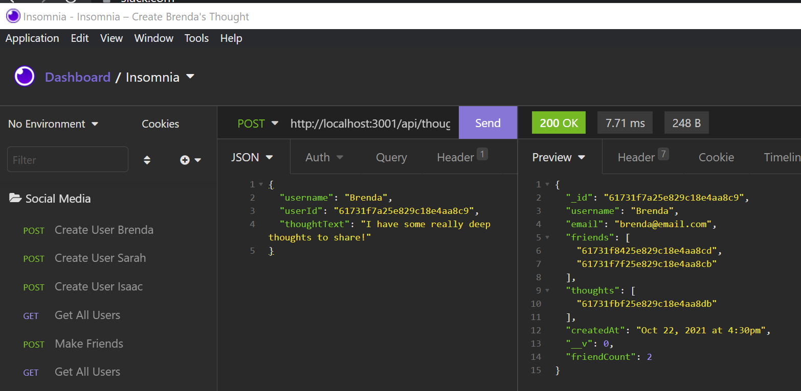

# Social Media
This challenge for Module 18 of the Coding Bootcamp is to build an API for a social network web application where users can share their thoughts, react to friends’ thoughts, and create a friend list.

* [User Story](#userStory)

* [Requirements](#requirements)

* [Technologies Used](#techUsed)

* [What I Learned](#whatILearned)

* [Social Media Screenshot](#webImage)

* [Social Media Demo](#projectDemo)

* [Contact Me](#contactMe)

---

## User Story

AS A social media startup

I WANT an API for my social network that uses a NoSQL database

SO THAT my website can handle large amounts of unstructured data

--- 

## Requirements

* Entering the command to invoke the application will start the server and sync the Mongoose models tothe MongoDB database.
* Opening API GET routes in Insomnia Core for users and thoughts will display the data in formatted JSON.
* Testing API POST, PUT, and DELETE in Insomnia Core will allow the user to create, update, and delete users and thoughts in the database.
* Testing API POST and DELETE routes in Insomnia Core will allowthe uer to create and delete reactions to thoughts and add and remove friends to a user's friend list.
* The following models must be used:
    * User
        * username
            * String
            * Unique
            * Required
            * Trimmed
        * email
            * String
            * Required
            * Unique
            * Must match a valid email address 
        * thoughts
            * Array of _id values referencing the Thought model
        * friends
            * Array of _id values referencing the User model (self-reference)
        * friendCount virtual
            * to retrieve the length of the user's friends array field on query.
    * Thought
        * thoughtText
            * String
            * Required
            * Must be between 1 and 280 characters
        * createdAt
            * Date
            * defaults to current timestamp
            * use a getter method to format the timestamp
        * username (The user that created this thought)
            * String
            * Required
        * reactions (These are like replies)
            * Array of nested documents created with the reactionSchema
        * reactionCount virtual
            * to retrieve the length of the thought's reactions array field on query.
    * Reaction (SCHEMA ONLY)
        * reactionId
            * Use Mongoose's ObjectId data type
            * Default value is set to a new ObjectId
        * reactionBody
            * String
            * Required
            * 280 character maximum
        * username
            * String
            * Required
        * createdAt
            * Date
            * defaults to current timestamp
            * use a getter method to format the timestamp
        * Reaction will not be a model but wil be used as the reaction field's subdocument schema in the Thought model
* The following API Routes are required:
    * /api/users
        * GET all users
        * GET a single user by its _id and populated thought and friend data
        * POST a new user:

                // example data  
                {  
                    "username": "Brenda",  
                    "email": "bjackels5@gmail.com"  
                }
            
        * PUT to update a user by its _id
        * DELETE to remove user by its _id
            * BONUS: Remove a user's associated thoughts when deleted.

    * /api/users/:userId/friends/:friendId
        * POST to add a new friend to a user's friend list
        * DELETE to remove a friend from a user's friend list

    * /api/thoughts
        * GET to get all thoughts
        * GET to get a single thought by its _id
        * POST to create a new thought (don't forget to push the created thought's _id to the associated user's thoughts array field)

                // example data  
                {  
                    "thoughtText": "Here's a cool thought...",  
                    "username": "Brenda",  
                    "userId": "5edff358a0fcb779aa7b118b"
                }
        * PUT to update a thought by its _id
        * DELETE to remove a thought by its _id

    * /api/thoughts/:thoughtId/reactions
        * POST to create a reaction stored in a single thought's reactions array field
        * DELETE to pull and remove a reaction by the reaction's reactionId value

---

## Technologies Used

* MongoDB
* Mongoose
* Node
* Insomnia Core
* Express.js

--- 

## I learned how to...

* Execute CRUD methods with MongoDB.
* Integrate Mongoose in an API.
* Create query builders to populate documents using refs.
* Explain the difference between SQL and NoSQL.
* Configure Heroku for deployment of a Node.js application using MongoDB.
* Explain and execute CRUD methods with MongoDB.
* Integrate Mongoose in a full-stack web application.
* Create query builders to populate documents using refs.
* Implement client-side NoSQL using IndexedDB.

---

## Social Media Screenshot

---

## Social Media Demo

---

## Contact Me
You can reach me, Brenda Jackels, at bjackels5@gmail.com.